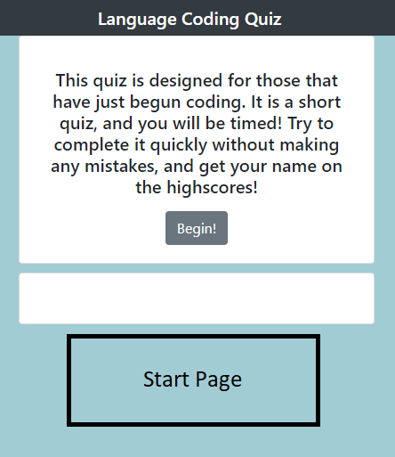
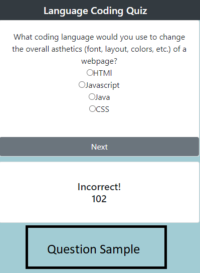
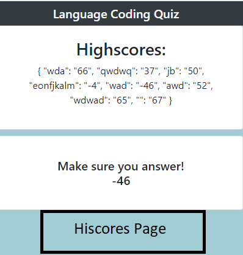

# CodingQuiz
Interactive Coding Quiz created for a Bootcamp project using HTML, CSS, JS, Bootstrap, and JSON for local storage.
The quiz utilizes a timer for score. Incorrect answers substract 15 points from the timer. Upon completing the last question, the timer stops.  
LiveLink: https://jpbeeson.github.io/CodingQuiz/

Start Page example:

Question page example:

HiScore page example:

